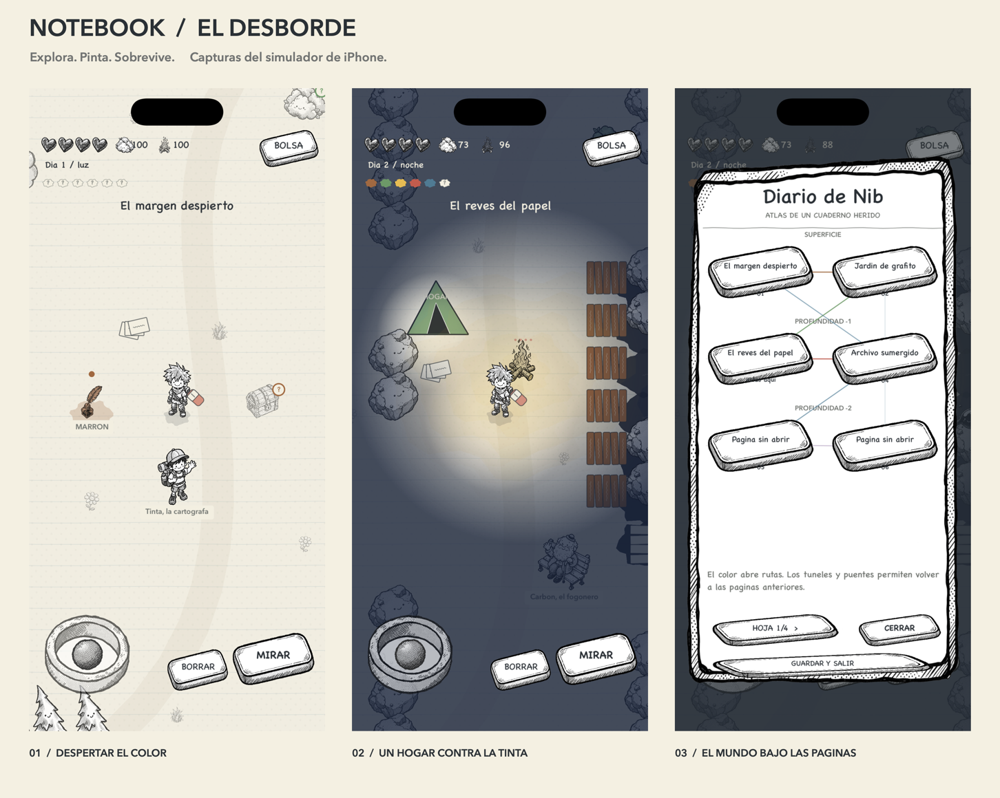

# Notebook Quest: El desborde

A hand-drawn survival adventure for iPhone, inside a notebook whose ink has
escaped its inkwell. Discover pigment, physically paint the world back into
existence, and follow six memories down through the pages.

The original black-and-white illustrations, generated with Azure OpenAI
`gpt-image-2`, are preserved. The adventure adds runtime watercolor washes,
paper constructions, eraser crumbs and warm firelight rather than replacing
the original art with a different style.

---

## What is in here

| Path | What it is |
| --- | --- |
| `NotebookGame/` | The iOS app: Swift 5, SpriteKit, SwiftUI shell. |
| `tools/` | The Python asset pipeline that talks to `gpt-image-2`. |
| `assets/` | Generated art. Bundled into the app as a folder reference. |
| `docs/` | Style guide and asset pipeline notes. |

---

## The game

You are **Nib**. The author has closed the notebook, and the ink no longer
remembers where its lines end. A four-part illustrated opening introduces the
mystery. NPCs guide you through six connected pages across three depths:

| Page | Depth | Discovery |
| --- | --- | --- |
| El margen despierto | Surface | Brown awakens chests and wooden passages. |
| Jardin de grafito | Surface | Green awakens trees and food; yellow holds light. |
| El reves del papel | -1 | Red + yellow unlock a fire that repels ink. |
| Archivo sumergido | -1 | Blue restores bridges and a shortcut to the margin. |
| La costura violeta | -2 | Violet and an improved eraser unlock the origin. |
| Corazon del tintero | -2 | Six recovered memories restore the inkwell. |

**Discovering a color does not automatically paint anything.** Approach an
unfinished object, paint it, then interact again to use it. Paper scraps, people,
pigment and written notes remain usable without color. Chests, plants, memories,
the inkwell and passages require their own pigment.

The adventure is continuous, not the demo's random turn-based battles. Nib
swings an **eraser**: creatures progressively lose opacity and disappear into
recoverable scraps. Memories improve its reach. Ink spreads at night, retreats
in daylight, and can be erased or contained with walls.

Daylight lasts 160 seconds and night 80. Food, warmth and the integrity of Nib's
outline matter. Collect renewable supplies, build paper paths over ink, wooden
walls, campfires and shelters. Fires consume fuel; resting nearby feeds them
wood. Shelters establish persistent return points. Getting smudged out costs
some supplies, not your colors, memories or buildings.

The atlas records visited pages and their return routes. NPC conversations
unlock progression; painted bridges and eraser-gated tunnels make backtracking
useful. The campaign has an ending and continued building/exploration afterward.

### iPhone controls

The world fills the entire screen. The original illustrated joystick, hearts
and paper buttons float over it; no dashboard reserves half the display. The
page title fades away, and the map, objective and supplies live in **BOLSA**.

Use the lower-left floating stick to move and the contextual paper button to
discover, paint, gather, talk or cross a page. **BORRAR** sweeps the nearby area.
**BOLSA > CONSTRUIR** opens recipes: choose one, face a tile, then **COLOCAR**. A green
outline means the placement is valid; paper paths and walls stay selected for
repeated placement. Reopen the workbench to cancel. **COMER**, **DESCANSAR** and
**DIARIO** are in the bag rather than permanent toolbars. Reading and menus
pause survival.

The new adventure saves atomically every five active seconds, after actions,
and when backgrounded. It uses `notebook-adventure-v2.json`; the original demo's
`notebookgame.save.json` is left untouched. Corrupt or incompatible files are
reported, not silently replaced. New game requires confirmation.

### Screenshots



[Nine iPhone screenshots](docs/screenshots/) show the actual game running in the
iPhone 17 Pro simulator, not concept art. They were captured by
[the iPhone workflow](https://github.com/jrubiosainz/notebookgame/actions/runs/33950749012).
Development captures use explicit, reproducible gameplay fixtures, including a
built night camp; they never overwrite a player's save.

---

## Building the app

Requirements: **Xcode 16 or newer**, iOS 17 deployment target.

```bash
open NotebookGame/NotebookGame.xcodeproj
```

Pick a simulator or device and run. There is nothing to install; the project has
no third-party dependencies.

The project uses Xcode 16 file-system synchronized groups, so new Swift files
are picked up automatically — just drop them in `NotebookGame/NotebookGame/`.
If you are on an older Xcode, regenerate the project instead:

```bash
brew install xcodegen
cd NotebookGame && xcodegen
```

> `assets/` is added as a **folder reference**, not a group. That is deliberate:
> it keeps `assets/<category>/<name>.png` intact inside the bundle, which is
> exactly the path the Python generator writes and the Swift `Art` loader reads.
> There is no manual bookkeeping between the two.

---

## Regenerating the art

All art is reproducible. See [`docs/ASSETS.md`](docs/ASSETS.md) for the full
walkthrough; the short version:

```bash
pip install -r tools/requirements.txt
cp .env.example .env.local        # then fill in your Azure values
python tools/generate_assets.py   # ~53 assets, resumable, cached
python tools/make_icon.py         # builds the app icon from the title art
```

Useful flags:

```bash
python tools/generate_assets.py --list             # show every asset and its state
python tools/generate_assets.py --only props       # one category
python tools/generate_assets.py --only tree_pine   # one asset
python tools/generate_assets.py --force            # ignore the cache
```

Generation is **idempotent**: each asset is cached against a hash of its final
prompt, so re-running only regenerates what actually changed. Interrupt it and
run it again; it picks up where it left off.

---

## Keeping the look consistent

This was the hard requirement, so it is enforced structurally rather than by
discipline.

`tools/style.py` holds the *only* description of the art direction. No prompt is
ever sent to the model raw — every one is assembled by `build_prompt()`:

```
STYLE_PREFIX  +  subject  +  [face rule]  +  [sheet rule]  +  STYLE_SUFFIX
```

An entry in `tools/manifest.py` therefore only ever describes *what the thing
is*, never *how it should look*:

```python
Asset("tree_pine", "a tall skinny pine tree", face=True)
```

To restyle the entire game you edit `style.py` and re-run with `--force`. You
never touch individual prompts. `tools/postprocess.py` then enforces true
grayscale and knocks the flat background out to alpha, because the model
occasionally sneaks in a faint colour cast.

Full details, including the exact wording that matters, are in
[`docs/STYLE_GUIDE.md`](docs/STYLE_GUIDE.md).

---

## Validating without a compiler

Two checks cover the things Xcode structurally cannot catch, and both are worth
running before you build.

**The maps.** They are ASCII art in `Data/MapCatalog.swift`, which is lovely to
edit and very easy to get subtly wrong. This parses the Swift source and checks
row widths, unknown tile characters, and whether every NPC, chest and exit is
standing somewhere actually reachable:

```bash
python tools/validate_maps.py
```

It caught three real bugs during development: an NPC inside a tree, a chest under
a tree, and an exit walled off by scenery.

**The asset names.** Swift asks for art by string, and the generator produces it
by string, and nothing checks that those two sets of strings agree — the
compiler is happy with any literal, and the generator is happy making something
nobody loads. So the convention gets a test:

```bash
python tools/validate_assets.py
```

It caught four real mismatches on its first run (`fx_slash` vs `slash_fx`, a
`ui/panel` that was never in the manifest, a battle backdrop nobody was
generating, and a hero-from-behind texture that already existed as frame 0 of the
walk-up cycle).

---

## Project layout

```
NotebookGame/NotebookGame/
  App/       SwiftUI entry point and the SpriteView host
  Core/      GameState (save + derived stats), Art loader, Paper theme, Haptics
  Data/      Bestiary, items, equipment, and the three maps
  Models/    Stats, progression curve, items, save file
  Scenes/    Original demo scenes, retained for reference
  Systems/   Tile map + collision, battle maths, player node
  UI/        Joystick, buttons, dialogue, HUD, menu and shop panels
  Adventure/ New campaign model, catalog, simulation, save store and SpriteKit scenes
```

`AdventureModel`, `AdventureCatalog`, `AdventureEngine` and `AdventureStore` are
pure Foundation. Simulation runs in fixed steps, saves its clocks, and is
independent of drawing, frame rate and touch input.

### Adventure regression suite and native preview

Run from the repository root with Apple's Swift command-line tools:

```bash
swiftc -swift-version 5 \
  NotebookGame/NotebookGame/Adventure/AdventureModel.swift \
  NotebookGame/NotebookGame/Adventure/AdventureCatalog.swift \
  NotebookGame/NotebookGame/Adventure/AdventureEngine.swift \
  NotebookGame/NotebookGame/Adventure/AdventureStore.swift \
  tools/validate_adventure.swift -o /tmp/validate-adventure
/tmp/validate-adventure
```

The checks walk the complete campaign with real movement and survival ticks,
including both return loops. They also cover paint-before-use, duplicate rewards,
map reachability, ink crossings, fire fuel/protection, walls, erasure, death,
resource renewal, frame partitioning, save round-trips and corruption handling.

The **same** SpriteKit scene can run on macOS as a developer preview without
Xcode or an iOS runtime:

```bash
swiftc -swift-version 5 -D DEBUG -O -framework Cocoa -framework SpriteKit \
  NotebookGame/NotebookGame/Adventure/*.swift tools/preview_adventure.swift \
  -o /tmp/NotebookPreview
/tmp/NotebookPreview
/tmp/NotebookPreview --validate
/tmp/NotebookPreview --capture /tmp/notebook-captures
/tmp/NotebookPreview --compact --capture /tmp/notebook-compact
```

WASD/arrows move; E interacts; Space erases; B opens the bag; C builds; J opens the diary.
`--validate` exercises the actual scene's controls, modal pause, paint/open
sequence, construction and preservation of a live game after a save failure.
It also checks that the illustrated joystick is used and broad HUD panels
cannot obscure the world.
`--compact` exercises a 375 x 667 point viewport. Captures are rendered at Retina
resolution. This is a development preview, **not a Steam release**. A desktop
edition still needs controller support, desktop layouts, packaging and platform
integration; the portable simulation and shared renderer provide a starting point.

`.github/workflows/ios.yml` builds Debug for iOS Simulator and unsigned Release
for iOS on GitHub's macOS runner, runs the regression suite, launches an iPhone
simulator and uploads screenshots plus the simulator app. Debug-only
`-notebook-capture <scene>` fixtures are excluded from Release.

---

## Original demo milestone

**Version 1.0 (build 1) was compiled and device-tested.** The original Xcode
project builds successfully in Release for both the iOS Simulator and a physical
iPhone, with no third-party dependencies. On 2 September 2026 it was signed,
installed and launched on a physical iPhone 13 Pro Max; no crash report was
produced.

The original title screen and generated artwork were inspected in the simulator. The asset
validator cross-checks every texture referenced by the 20 Swift source files, and
the map validator confirms the dimensions, tile vocabulary and reachability of
all three maps. The app icon is a 1024×1024 opaque GPT Image 2 emblem of Nib
raising a pencil-sword over an open notebook; its generation subject remains in
`tools/manifest.py`, and `python tools/make_icon.py` installs the flattened icon
into the Xcode asset catalogue.

Validated with:

```bash
python tools/validate_assets.py
python tools/validate_maps.py
xcodebuild -project NotebookGame/NotebookGame.xcodeproj \
  -scheme NotebookGame -configuration Release \
  -destination 'generic/platform=iOS' build
```

---

## Licence

MIT. See [LICENSE](LICENSE).
